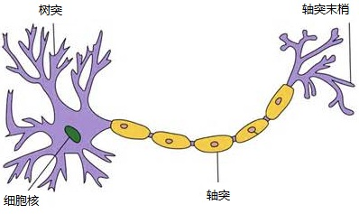
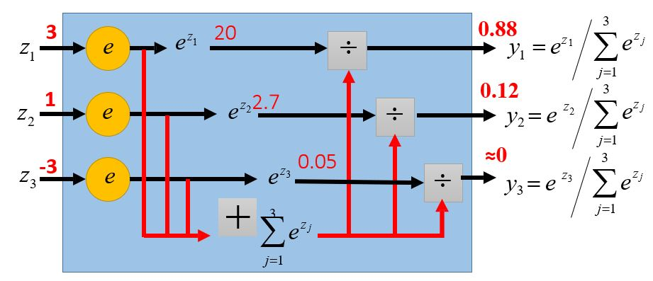
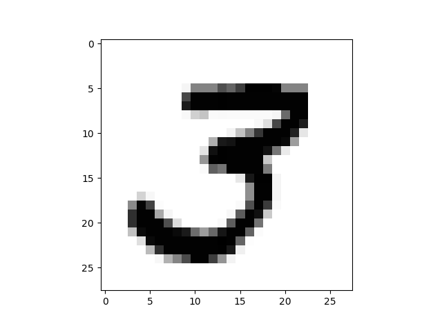

### 1 深度学习的介绍

#### 1.1 深度学习简介

##### 1.1.1 深度学习的常见应用

- 语音识别
- 图像识别
- 下围棋(Alpha Go)
- 对话系统

##### 1.1.2 深度学习的目标

机器学习的目标在于，寻找一个函数$f$，将输入数据映射到输出数据。例如：

- 语音识别将一段音频的输入映射到对应的文字输出；
- 图像识别将一个图片的输入映射到对应的类别输出；
- 围棋系统将历史的对弈数据输入映射到下一步棋决策的输出；
- 对话系统将上一句文本内容的输入映射到系统回答的输出。

而深度学习的目标在于，寻找一个框架，即一系列的函数模型$f_i$，利用训练数据进行拟合，再根据训练效果从中挑选出最优的模型。

##### 1.1.3 深度学习的三个步骤

1. [定义一组函数](https://tool.lu/markdown/#jump1)
2. [模型和数据的拟合](https://tool.lu/markdown/#jump2)
3. [选择最优函数](https://tool.lu/markdown/#jump3)

##### 1.1.4 定义一组函数：神经网络

**1. 神经网络的基本结构：神经元**

人脑的一个神经元通常具有多个`树突`，用于接收传入的信息；这些树突连接着一条`轴突`，轴突尾端有许多轴突末梢，与其他多个神经元之间产生连接，从而传递信息。这个连接位置在生物学上称为`突触`。 其形状结构如下：



类似的，神经元模型是一个包含输入、输出和计算功能的模型。其输入可以类比为生物神经元的树突，输出可以类比为生物神经元的轴突，计算则可以类比为细胞核。

下图是一个典型的神经元模型：包括3个输入，1个输出，两个计算功能。


当确定输入、权重、偏差的值以及激活函数的形式后，我们可以通过如上计算图计算出输出a。一个简单的例子如下：


**2. 神经网络的概念**

将不同的神经元连接起来形成的网络结构就是神经网络。需要注意的是，每个神经网络都可能拥有不同的权重和偏差值，且不同的连接方式也会导致不同的网络结构。权重和偏差都是神经网络的参数$\theta$。


**3. 一种最简单的神经网络：完全连接前馈神经网络**

前馈神经网络是一种最简单的神经网络，各神经元分层排列。每个神经元只与前一层的神经元相连。接收前一层的输出，并输出给下一层．各层间没有反馈。
完全连接前馈神经网络指的是各层神经元之间是全连接的。
下图是一个简单的例子：


**4. 层的性质**

输入层和输出层通常只有一个，但隐含层可以有很多个。隐含层的个数体现了深度学习的“深度”。

> ###### TODO：ImageNet网络层深度介绍

对于分类问题，我们需要将输出层的输出映射到标签类别上。常见的一个做法是使用softmax函数作为输出层。它的基本原理是利用指数函数$e^x$，输出一个列表，保证所有数属于[0, 1]且和为1，从而表示该对象属于各个类别的概率。最后，我们选择概率数值最大的类别作为我们的预测标签。


**5. 一个简单例子：手写数字识别**

MNIST是深度学习入门的一个经典数据集，kaggle上提供了一个基于此数据集的训练项目[Digit Recognizer](https://www.kaggle.com/c/digit-recognizer)。 MNIST数据集主要是由一些手写数字图片所代表的像素值和图片相应的标签组成。图片一共有十类，分别对应0~9这10个阿拉伯数字。
我们的目标是根据训练集中已有的图片像素属性和标签，对测试集中的图片样本的标签进行预测。
下图是MNIST数据集中一个图片样本：



一种可行的方法是，将$(28 \times 28)$个像素值矩阵拉长成一个$(784 \times 1)$维列向量作为输入层，经过一些隐含层后，与一个softmax输出层相连，输出一个$(10 \times 1)$的列向量，其中每个数值代表了该样本属于09中各个数字标签的概率。
我们根据训练集中的真实标签反向求出各层网络各个神经元的最优参数$\theta$，并将训练得的网络模型应用在测试集上得出预测标签。


##### 1.1.5 模型和数据的拟合：以MNIST为例

**1. 训练数据**

图片的像素值矩阵与每张图片对应的标签。

**2. 学习目标**

对于训练数据，我们希望每个样本通过神经网络模型得出的概率列表中，真实标签拥有最大的概率值。也就是说，对于真实标签为3的样本，我们希望通过softmax得出的概率列表尽可能地接近$[0, 0, 1, 0, \dots]$。

我们将通过神经网络输出的概率向量与最优概率向量之间的差别定义为损失$l$。将所有样本的损失加和得总损失$L=\sum\limits_{k=1}^nl_k$，我们的目标为：找到一个函数，使得总损失$L$最小，也即找到一组参数$\theta$使得总损失函数$L$最小。

> ###### TODO: 损失函数的选择

##### 1.1.6 选择最优函数

**1. 概述**

其实我们总能列举所有的值，暴力搜索出最好的一组参数$\theta=\{w_1, w_2, \dots, b_1, b_2, \dots \}$。但是这种方法的效率极为低下，对于一个输入和输出均有1000个神经元的全连接网络层，我们就有$10^6$个参数需要拟合。因而在深度神经网络中，暴力搜索几乎是不可能的。

由于损失函数是我们自己定义的，我们总可以将其设置为凸函数或者近似凸函数，于是便可以利用运筹学的知识，提高我们的搜索效率，更快地找到全局最优解，或者退而求其次地找到可行且效果接近全局最优解的局部最优解。

梯度下降是神经网络模型训练中最常用的一种优化算法。

**2. 梯度下降法**

首先，选择权重矩阵$W$的初始值。我们直接采用随机定义，或者RBM预训练。

每次迭代的过程中，我们首先计算出当前状态的梯度，然后从当前状态向负梯度方向移动一个步长单位，达到新的状态。

W_{n+1} \leftarrow W_n - \eta \nabla L(W)

直到当前梯度接近于0时，我们认为找到了一个局部最优解，并停止训练。

选取负梯度方向是因为这是梯度下降最快的方向，也即损失函数下降最快的方向。步长即“学习率”，是我们需要事先给定的超参数。学习率太小会导致训练过慢，学习率太高则可能越过最低点而导致更高的损失值。学习率可能是神经网络训练中最重要的超参数设定之一，在调参过程中，我们总是最先确定学习率的值，再确定其他参数。我们既可以选择常数学习率，也可以随着迭代次数的增加逐渐减小学习率，常用的做法有$1/\sqrt{k+1}, 1/\lVert W\rVert ^2$等。

> ###### TODO：梯度下降法介绍

以上算法中最消耗计算资源的便是每一次迭代中的求梯度过程。我们自然可以通过极限$\lim\limits_{h \to 0}[f(x+h)-f(x-h)]/2h$来近似求梯度。但是，当网络非常复杂、参数非常多时，每迭代一次都要重新计算非常多次损失函数的梯度，导致计算十分缓慢。一种比较好的改进方法是利用链式法则，用反向传播法求梯度。

**3. 反向传播法**

下面是cs231n关于理解反向传播法的一个小例子。


#### 1.2 为什么使用深层网络？

首先，不是更多的参数就意味着更好的性能，一味地增加网络层数可能会导致更严重的过拟合，反而降低了泛化性能。而参数数量相同的情况下，更瘦更深的网络总是比浅而广的网络效果更好。因为使用诸如ReLU等非线性单元的神经网络在数学上相当于一个分片线性函数，线性区域越多，神经网络的非线性性越强，就有可能取得更好的效果。这就像折纸，越深的网络将纸对折越多次，得到的线性区域也越多。这也是为什么我们称之为“深度学习”而非“广度学习”。[[参考链接1\]](https://www.zhihu.com/question/62705160) [[参考链接2\]](https://arxiv.org/pdf/1402.1869.pdf)

> TODO：模块化

#### 1.3 深度学习简单实战

**1. 定义一组函数**

```python
# 建立模型
print('#################### Define Model ##########################')
model = Sequential()
model.add(Conv2D(filters=32, kernel_size=(5, 5), activation='relu', input_shape=(28, 28, 1)))
model.add(Conv2D(filters=32, kernel_size=(5, 5), activation='relu'))
model.add(MaxPool2D(pool_size=(2, 2)))
model.add(Dropout(0.25))
model.add(Conv2D(filters=64, kernel_size=(3, 3), activation='relu'))
model.add(Conv2D(filters=64, kernel_size=(3, 3), activation='relu'))
model.add(MaxPool2D(pool_size=(2, 2), strides=(2, 2)))
model.add(Dropout(0.25))
model.add(Flatten())
model.add(Dense(256, activation="relu"))
model.add(Dropout(0.5))
model.add(Dense(10, activation="softmax"))
model.summary()
```

**2. 模型和数据的拟合**

```python
loss='categorical_crossentropy'
```

**3. 选择最优函数**

```python
# 配置模型
optimizer = RMSprop(lr=0.001, rho=0.9, epsilon=1e-8, decay=0)
model.compile(loss='categorical_crossentropy', optimizer=optimizer, metrics=['accuracy']) # 拟合模型：找到最优参数
history = model.fit(x_train, y_train, batch_size=batch_size, epochs=nb_epochs, validation_data=(x_val, y_val), callbacks=[checkpoint], verbose=2)
```

> ##### TODO：MNIST手写识别