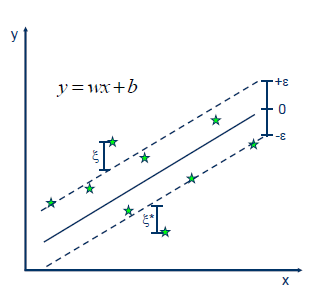

## SVR

SVR的基本思路是：找到一个超平面，上下有两条条带为$\varepsilon$的条带，假设在两条条带之内的数据点预测正确（误差为0），希望最小化条带以外的数据点到条带边界的距离和。

也即：$L_{\varepsilon}(y,f(x,w))=\begin{cases} 0, & \text {if $|y-f(x,w)| \leq \varepsilon$} \\ |y-f(x,w)|-\varepsilon, & \text{otherwise} \end{cases}$

总体损失为$\min L(w)=\sum\limits_{i=1}^{n}L_{\varepsilon}(y,f(x,w))$。其中$f(x,w)=w^Tx+b$

设$y=wx+b+\varepsilon$上的点到该条带的距离为$\xi\geq 0$，$y=wx+b-\varepsilon$下的点到该条带的距离为$\xi^*\geq 0$。

则损失也可以写成$\min L(w)=\sum\limits_{i=1}^{n}(\xi_i+\xi_i^*)$，其中$\xi_i$和$\xi_i^*$中一个大于0时另一个必定为0，也即$\xi_i\xi_i^*=0$。（事实上，由于我们的模型是希望最小化$\xi_i$、$\xi_i^*$的和，最终收敛的结果一定满足该等式。）

与带软约束的SVC模型类似，我们加入$\frac{1}{2}||w||^2$作为正则项来防止过拟合，$C$为正则化系数。则总体模型为：

$$
\begin{align}
\min L(w)&=\frac{1}{2}||w||^2+C\sum\limits_{i=1}^{n}(\xi_i+\xi_i^*)\\
s.t. & 
\begin{cases}
y_i-(w^Tx_i+b)\leq \varepsilon+\xi,&i=1,...,n \\
(w^Tx_i+b)-y_i\leq \varepsilon+\xi^*,&i=1,...,n \\
\xi_i,\xi_i^* \geq 0,&i=1,...,n
\end{cases}
\end{align}
$$

引入拉格朗日乘子，根据KKT条间可以求得SVR的闭式解。

## SVM

我们的目标是找到一个支撑超平面，这个超平面能够最大程度地将正负两类样本点分开。也就是说，距离超平面最近的两个点（分属于两种类别）的间隔最大。

假设最近点到超平面的距离为$\delta$，也即$w^Tx + b=\delta$，同时缩放$w$和$b$，可以将其转化为$w^Tx + b=1$。也就是说，距离超平面最近的两个点满足：

$$
\begin{align}
w^Tx_1 + b&=1 \\
w^Tx_2 + b&=-1
\end{align}
$$

稍加转化可以得到，

$$
\begin{align}
\left(w^{T} x_{1}+b\right)-\left(w^{T} x_{2}+b\right)&=2 \\
   w^{T}\left(x_{1}-x_{2}\right)&=2 \\
   w^{T}\left(x_{1}-x_{2}\right)=\|w\|_{2}\left\|x_{1}-x_{2}\right\|_{2} \cos \theta&=2 \\
   \left\|x_{1}-x_{2}\right\|_{2} \cos \theta&=\frac{2}{\|w\|_{2}} \\
  
   d_{1}=d_{2}=\frac{\left\|x_{1}-x_{2}\right\|_{2} \cos \theta}{2}&=\frac{\frac{2}{\|w\|_{2}}}{2}=\frac{1}{\|w\|_{2}} \\
   d_{1}+d_{2}&=\frac{2}{\|w\|_{2}}
 \end{align}
$$

假设正类样本真实标签为1，负类样本真实标签为-1（这里为了简化模型，与一般模型的设计不太一样，其他模型常将正类设置为1，负类设置为0）

因此SVM可以被表示为：
$$
\begin{align}
\min \ L(w,b)&=\frac{1}{2}||w||^2\\
s.t. & 
\begin{cases}
w^Tx_i+b \geq 1,&\text{if} \ y_i = 1 \\
w^Tx_i+b \leq -1,&\text{if} \ y_i = -1 \\
\end{cases}
\end{align}
$$
可以将两个条件合并为 $y_i(w^Tx_i+b) \geq 1$，从而模型转化为：

$$
\begin{align}
\min \ L(w,b)&=\frac{1}{2}||w||^2\\
s.t.\ & 
y_i(w^Tx_i+b） \geq 1,&i=1,...,n \\
\end{align}
$$
通过拉格朗日乘子法求解。

**加入软约束**

如果数据集中存在一些噪声数据，则数据不能被完全可分，此时我们可以对原始损失函数添加一个软约束。模型具体形式为：

$$
\begin{align}
\min \ L(w,b,\xi)&=\frac{1}{2}||w||^2+C\sum\limits_{i=1}^n\xi_i\\\
s.t. & 
\begin{cases}
y_i(w^Tx_i+b) \geq 1-\xi_i,&i=1,...,n \\
\xi_i\geq 0,&i=1,...,n \\
\end{cases}
\end{align}
$$
**非线性支持向量机**

对于完全不线性可分的数据集，一种可能的方式是将数据投影到更高维的空间上，此时在低维空间中线性不可分的数据集可能会编程线性可分的。我们使用核函数来将数据映射到高维空间，常用的核函数有：

- 多项式核函数（Polynomial Kernel）：$ K\left(\mathbf{x}_{i}, \mathbf{x}_{j}\right)=\left(\left\langle\mathbf{x}_{i}, \mathbf{x}_{j}\right\rangle+c\right)^{d}$ 
- 高斯核函数（Gaussian Kernel）：$ K\left(\mathbf{x}_{i}, \mathbf{x}_{j}\right)=\exp \left(-\frac{\left\|\mathbf{x}_{i}-\mathbf{x}_{j}\right\|_{2}^{2}}{2 \sigma^{2}}\right)$ 
- Sigmoid核函数（Sigmoid Kernel）：$ K\left(\mathbf{x}_{i}, \mathbf{x}_{j}\right)=\tanh \left(\alpha \mathbf{x}_{i}^{\top} \mathbf{x}_{j}+c\right)$ 
- 余弦相似度核函数：$K\left(\mathbf{x}_{i}, \mathbf{x}_{j}\right)=\frac{\mathbf{x}_{i}^{\top} \mathbf{x}_{j}}{\left\|\mathbf{x}_{i}\right\|\left\|\mathbf{x}_{j}\right\|}$ 