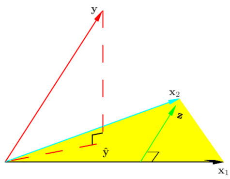

# 第三章 线性模型

## 线性回归

### 最小二乘估计

假设$X$和$Y$之间存在线性关系，模型的具体形式为：$\hat{Y}=Xw$    

也即：$Y=\hat{Y}+\varepsilon=Xw+\varepsilon$，其中$\varepsilon$表示误差。

我们通过最小化误差的平方和来估计模型的最优参数$w$（**最小二乘估计**）。

$$
\begin{align}
\min \ L(w)&=||Y-Xw||^2 \\
&=(Y-Xw)^T(Y-Xw) \\
&=Y^TY-2w^TX^TY+w^TX^TXw
\end{align}
$$

由于$L(w)$关于$w$是一个凸函数，根据一阶条件对$w$求偏导即可得到全局最优解。

$\frac{\partial{L(w)}}{\partial{w}}=2X^TXw-2X^TY=0 \Rightarrow   w=(X^TX)^{-1}X^TY$

**几何解释**

在线性代数中，我们知道两个向量a和b相互垂直可以得出：$<a,b> = a\cdot b = a^Tb = 0$,而平面X的法向量为$Y-Xw$，与平面X互相垂直，因此：$X^T(Y-Xw) = 0$，即：$w = (X^TX)^{-1}X^TY$ 。

### 极大似然估计

除了最小二乘估计，我们也可以使用**极大似然估计**来对参数$w$进行估计，其核心思想是给定自变量$X$和参数$w$，出现观测值$Y$的概率最大。假设误差$\varepsilon$服从正态分布，$\varepsilon\backsim N(0,\sigma^2)$。

也即：
$$
\begin{align}
\max L(w) &=\log P(Y|X;w)\\
&= \log \prod_{i=1}^n P(y_i|x_i;w) \\
&= \sum\limits_{i=1}^{n} \log P(y_i|x_i;w)\\
&= \sum\limits_{i=1}^{n}\log(\frac{1}{\sqrt{2\pi}\sigma}\exp(-\frac{(y_i-w^Tx_i)^2}{2\sigma^2}))\\
&= \sum\limits_{i=1}^{n}[log(\frac{1}{\sqrt{2\pi}\sigma})-\frac{1}{2\sigma^2}(y_i-w^Tx_i)^2]
\end{align}
$$

$L(w)$关于参数$w$是一个凹函数，而最大化一个凹函数可以转化为最小化一个凸函数，也即：

$\min -L(w)=\sum\limits_{i=1}^{n}[(y_i-w^Tx_i)^2]+C$，其中$C$为一个常数。

该问题就转化成了最小二乘法问题。也就是说，**线性回归的最小二乘估计$\Leftrightarrow$噪声$\epsilon\backsim N(0,\sigma^2)$的极大似然估计**。

> **计算机的最优值求解**
>
> 在实际使用过程中，当数据量非常庞大时，$(X^TX)$的逆运算会消耗大量的资源（$O(n^3)$），因此我们通常采用近似算法来逼近最优解。最小二乘法问题是一个无约束凸优化问题，因此我们可以直接使用梯度下降法进行拟合。其核心思路是：每次在梯度下降方向$-\nabla L(w^k)$走一小个步长$\alpha _k$，保证$L(w^{k+1})=L(w^{k})-\alpha _k\nabla L(w^k)\leq L(w^{k})$，则当搜索了足够多次时，模型能够收敛到全局最小值。

## 对数几率回归（逻辑回归）

使用sigmoid函数作为预测为正类的概率。也即：

$$
p_1=P(y=1|x)=\frac{1}{1+e^{-w^Tx}}
$$
假设标签数据服从伯努利分布，也即：
$$
P(y|x)=
\begin{cases}
p_1, &\text{if} \ y = 1 \\
1-p_1, & \text{if} \ y=0
\end{cases}
$$

将$p_1$等式转化一下，可以得到：

$$
\ln \frac{p_1}{1-p_1}=w^Tx
$$

也就是说，我们实际上是在用线性回归模型去逼近真实标记的对数几率（正例/负例的可能性），因此称为对数几率回归。

使用**极大似然估计**来对参数$w$进行估计，其核心思想是给定自变量$X$和参数$w$，出现观测值$Y$的概率最大。
$$
\begin{align}
\max L(w) &=\log P(Y|X;w)\\
&= \log \prod_{i=1}^n P(y_i|x_i;w) \\
&= \sum\limits_{i=1}^{n} \log P(y_i|x_i;w)\\
&= \sum\limits_{i=1}^{n}y_i\log p_1+(1-y_i)\log (1-p_1)\\
\end{align}
$$

使用梯度下降法进行求解。

## 线性判别分析

核心思想：从几何角度，让全体样本经过投影后，同类样本的投影尽可能近，异类样本的投影尽可能远。

**同类样本的投影尽可能近**：同类样本的方差尽可能小

$$
\min w^T\Sigma_0 w+w^T\Sigma_1 w
$$

**异类样本的投影尽可能远**：异类样本的中心尽可能远
$$
\max ||w^T\mu_0-w^T\mu_1||_2^2
$$
两者结合起来：
$$
\max J=\frac{||w^T\mu_0-w^T\mu_1||_2^2}{w^T\Sigma_0 w+w^T\Sigma_1 w}=\frac{w^TS_bw}{w^TS_ww}
$$
其中$S_w=\Sigma_0+\Sigma_1$，$S_b=(\mu_0-\mu_1)(\mu_0-\mu_1)^T$

注意到，上式的分子分母都是关于$w$的二次项，因此解与$w$的长度无关，而只与其方向有关，不失一般性地，令$w^TS_ww=1$，则上式等价为：
$$
\begin{align}
\min_w &-w^TS_bw \\
s.t. \ & w^TS_ww=1
\end{align}
$$

使用拉格朗日乘子法求解，得到$w=S_w^{-1}(\mu_0-\mu_1)$